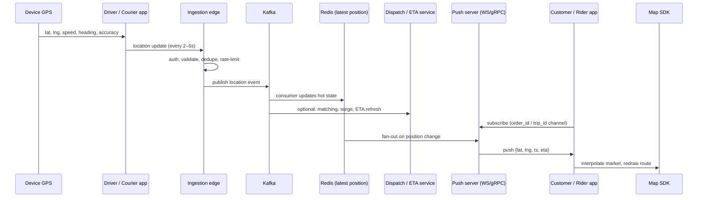
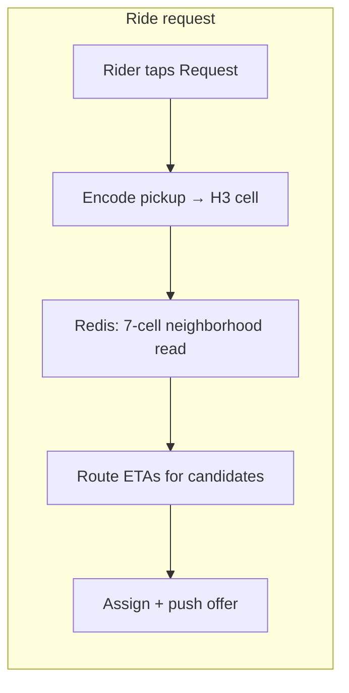
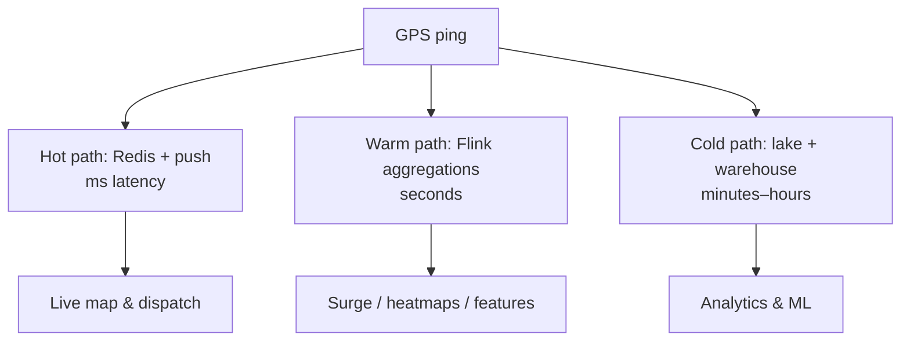

# How Maps & Location Work in Transport and Food-Delivery Apps

[← Back to index](./README.md)

## The user-visible experience

When you open Uber or Swiggy, you see:

1. A **basemap** (roads, labels, buildings)
2. **Pins** for pickup, drop, restaurant, or home
3. A **moving icon** (car, bike) that glides smoothly
4. An **ETA** that updates as traffic and position change

Behind that simple UI is a pipeline that runs continuously from GPS sensor to pixel on screen.

## End-to-end data flow



## Ride-hailing: driver ↔ rider

### Phase 1 — Discovery & request

1. **Rider** opens app; map SDK shows current location (device GPS + reverse geocoding).
2. Rider sets pickup/drop; app sends request to **demand service**.
3. **Dispatch engine** finds nearby available drivers (spatial index — see [topic 2](./02-databases-and-spatial-indexing.md)).
4. **Routing service** computes road-network ETAs for candidates (not straight-line distance).
5. Best driver is selected; **push layer** sends offer to driver app (&lt;100 ms target at Uber scale).

### Phase 2 — Active trip

1. Driver app streams GPS on a **persistent connection** (gRPC stream or WebSocket).
2. Positions land in **Redis ring buffer** (last N points) for sub-ms reads.
3. Rider app subscribes to trip channel; receives pushes when driver moves.
4. **Map rendering** smooths discrete GPS into continuous animation (Kalman filter, interpolation, map matching).

### Phase 3 — Post-trip

1. Full GPS trail may be written to **Cassandra / data lake** for disputes, safety, analytics.
2. Transactional trip record lives in **SQL** (PostgreSQL, etc.).



Uber’s dispatch pattern: convert pickup to an **H3 cell**, read that cell plus six neighbors from Redis (`gridDisk` k=1), then expand rings only if too few drivers — O(1) lookup instead of scanning the fleet ([Uber H3 blog](https://www.uber.com/us/en/blog/h3/), [dispatch deep-dive](https://medium.com/codetodeploy/uber-architecture-part-5-the-dispatch-engine-and-map-rendering-64ac669fa698)).

## Food delivery: agent ↔ restaurant ↔ customer

Food tracking is narrower in scope but similar in plumbing:

| Stage | What the map shows | Location actors |
|-------|-------------------|-----------------|
| Order placed | Restaurant pin, your address | Static POIs |
| Agent assigned | Courier icon appears | Courier GPS → customer channel |
| Pickup | Route to restaurant | Courier + restaurant geofence |
| En route | Smooth movement + ETA | Same push pipeline |
| Delivered | Final pin | Trip ends; TTL expires on Redis keys |

**Key difference from ride-hailing:** during tracking, the system cares about **one courier and one order**, not fleet-wide nearest-neighbor search. Hot path is:

```
Courier app → API → Kafka → Worker → Redis (order_id → latest lat/lng) → WebSocket → Customer app
```

([Zomato-style tracking breakdown](https://medium.com/@anuragkumbhare2043/how-zomato-shows-live-delivery-partner-movement-without-page-refresh-0a4148af3837), [producer-consumer decoupling](https://gsavitha.in/blog/real-time-delivery/))

## Mobile-side responsibilities

### Driver / courier app

- Background **location service** (OS-level) with battery-aware intervals
- **Adaptive frequency**: faster updates when moving quickly or near destination
- **Batching**: send 2–3 points per message to cut connection overhead
- **Map matching**: snap raw GPS to road graph before display
- **Offline buffer**: queue points when network drops; replay on reconnect

### Customer / rider app

- **Subscribe once** to order/trip channel (WebSocket or SSE)
- **Never poll** the map every second — server pushes
- **Interpolate** between updates (1–2 s animation) so marker does not jump
- Load basemap tiles from CDN; only overlay dynamic markers locally

## Backend processing on each GPS ping

| Step | Purpose | Typical latency |
|------|---------|-----------------|
| Auth (JWT / session) | Prevent spoofed locations | 1–5 ms |
| Validation | Drop impossible jumps, stale timestamps | &lt;1 ms |
| H3 / geohash encoding | Partition for Kafka & Redis | microseconds |
| Write hot state | Latest position for dispatch/tracking | 1–15 ms |
| Async fan-out | Analytics, surge, audit trail | decoupled via Kafka |

## Namma Yatri & open mobility (India)

[Namma Yatri](https://github.com/nammayatri/nammayatri) separates concerns:

- **Core app (Haskell)** — Beckn/ONDC ride lifecycle, fares, payments
- **[location-tracking-service (Rust)](https://github.com/nammayatri/location-tracking-service)** — dedicated GPS ingestion
- **[notification-service (Rust)](https://github.com/nammayatri/notification-service)** — gRPC bidirectional streaming over Redis Streams

This mirrors industry practice: **location is its own microservice** because write volume and latency requirements differ from transactional ride APIs.

## Map matching & road snapping

Raw GPS is noisy (±5–50 m). Production systems run **map matching**:

1. Project GPS point onto nearest road segment in routing graph
2. Reject points that imply impossible speed
3. Use **Kalman or particle filters** for smooth trajectories (Uber uses server-side state for billions of pings)

Output: coordinates customers trust for ETAs and turn-by-turn navigation.

## Geofencing

Virtual boundaries trigger business logic without constant polling:

- Courier arrived at restaurant (pickup geofence)
- Driver entered airport zone (surge / compliance)
- Delivery completed within X meters of customer pin

Implemented with point-in-polygon (PostGIS) or H3 cell set membership for high throughput.

## Failure modes users notice

| Symptom | Common cause | Mitigation |
|---------|--------------|------------|
| Icon frozen | WebSocket dropped; app not reconnecting | Exponential backoff + FCM fallback |
| Icon jumps | No interpolation; GPS outlier | Kalman filter + map matching |
| Wrong ETA | Stale traffic model or bad geocode | Matrix API with live traffic; rooftop geocoding |
| Driver “teleports” | Cell handoff, GPS glitch | Anomaly detection at ingestion edge |

## Mental model

Think of three parallel paths for every GPS ping:



## Further reading

- [02 — Databases & spatial indexing](./02-databases-and-spatial-indexing.md)
- [07 — Live updates & real-time relay](./07-live-updates-and-real-time-relay.md)
- [Uber Architecture Part 5 — Dispatch & rendering](https://medium.com/codetodeploy/uber-architecture-part-5-the-dispatch-engine-and-map-rendering-64ac669fa698)
- [Swiggy — Navigating new routes (maps team)](https://blog.swiggy.com/women-in-tech/navigating-new-routes-meet-the-ladies-who-read-build-maps/)
