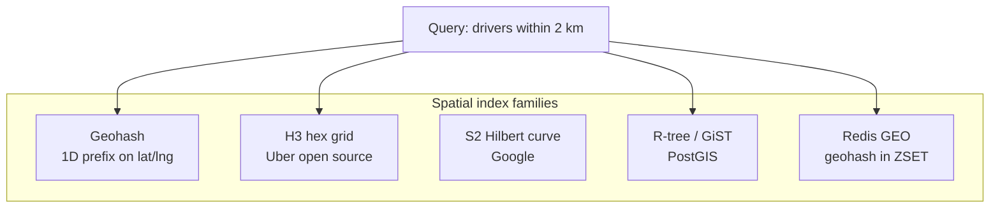
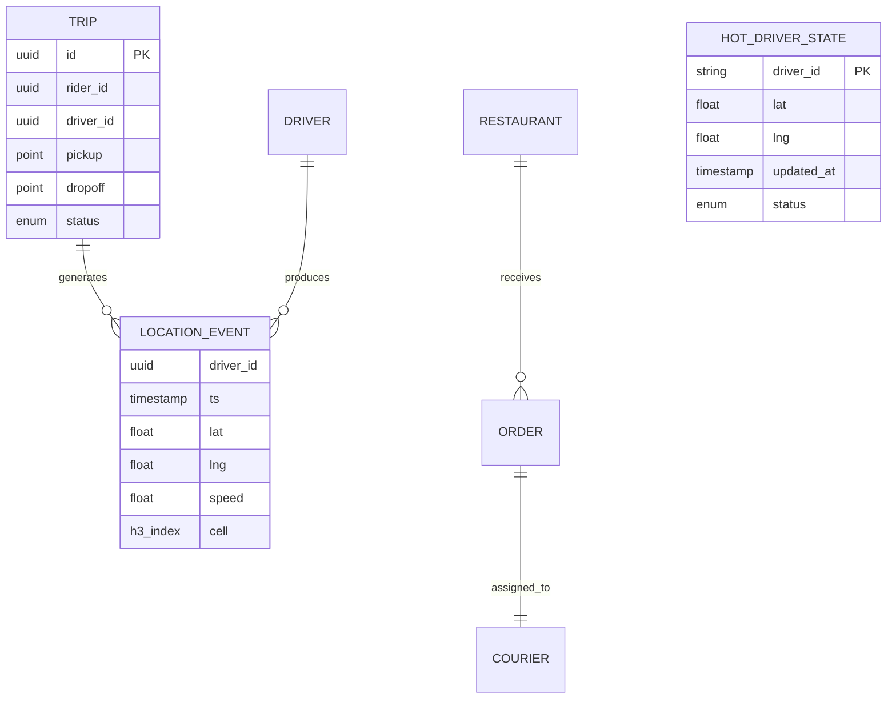

# Databases & Spatial Indexing for Location Systems

[← Back to index](./README.md)

## Short answer

No single database wins. Production stacks use **polyglot persistence**:

| Store type | Examples | Role in maps stack |
|------------|----------|---------------------|
| **In-memory + geo index** | Redis GEO, Redis + H3 keys | Latest driver positions; sub-ms radius queries |
| **Relational + spatial** | PostgreSQL + PostGIS | Trips, users, restaurants; polygons, geofences |
| **Wide-column / time-series** | Cassandra, ScyllaDB | Durable GPS history; time-range scans |
| **Document / KV** | MongoDB, DynamoDB, Aerospike | Distance caches, feature flags, session state |
| **Stream log** | Kafka, Redis Streams | Durable event bus; replay & decoupling |
| **Data lake / warehouse** | S3 + Hudi/Iceberg, Snowflake | Analytics, ML features |

**Spatial** capability appears in PostGIS (R-tree/GiST), Redis GEO (geohash sorted sets), and dedicated indexes like **H3**, **S2**, and **geohash**.

## Why one SQL database is not enough

At Uber-scale (~83K+ GPS writes/sec globally), a single Postgres instance tops out around **10K–20K simple writes/sec** before replication and spatial indexes make it worse ([Uber architecture analysis](https://ai.plainenglish.io/uber-architecture-part-1-why-tracking-5-million-drivers-every-second-is-one-of-techs-hardest-6ca606892497)).

GPS coordinates are useless unless you can **query by geography**. Spatial queries plus **continuous writes** create read/write contention — exactly when dispatch needs low latency.

**Pattern:** separate **hot** (RAM), **warm** (stream), and **cold** (disk) stores ([topic 4](./04-high-volume-data-management.md)).

## Spatial indexing options compared



| Index | Query type | Write pattern | Best at scale for |
|-------|-----------|---------------|-------------------|
| **Geohash** | Prefix range scan | Frequent updates | Redis, DynamoDB range keys |
| **H3** | k-ring (cell + neighbors) | Cell bucket updates | Fleet dispatch, heatmaps |
| **S2** | Hilbert curve cells | Cell bucket updates | Global KV stores |
| **PostGIS GiST** | ST_DWithin, polygons | Moderate | Geofences, static POIs |
| **Redis GEO** | GEORADIUS | Very frequent | &lt;1M drivers, simple radius |

Rule of thumb from industry writeups: **PostGIS below ~50K active drivers; H3 + Redis above that** ([spatial indexing at scale](https://news.lavx.hu/article/spatial-indexing-at-scale-why-uber-chose-hexagons-over-grids-for-real-time-driver-matching)).

## H3 — Uber’s hexagonal grid

[H3](https://www.uber.com/us/en/blog/h3/) partitions Earth into hierarchical hex cells (resolutions 0–15):

- **`geoToH3(lat, lng, res)`** → 64-bit cell ID
- **`gridDisk(cell, k)`** → center + ring of neighbors (k=1 → 7 cells)
- **Uniform neighbor distance** — hexagons beat squares for gradient/smoothing

**Dispatch write path:**
```
GPS → H3 cell at res 9 (~174 m edge) → Redis SET/Sorted structure keyed by cell_id
```

**Dispatch read path:**
```
Pickup → H3 cell → gridDisk(k=1) → Redis MGET 7 keys → candidate driver IDs
```

## Redis GEO

Redis stores locations in a **sorted set** scored by 52-bit geohash:

```redis
GEOADD drivers:blr 77.5946 12.9716 driver_42
GEORADIUS drivers:blr 77.5946 12.9716 3 km ASC COUNT 20
```

- **GEOADD**: O(log N)
- **GEORADIUS**: O(log N + M) where M = results returned
- At **1M drivers × 1 update/4s ≈ 250K writes/sec** → Redis Cluster sharded by **city** or **H3 prefix**

Often combined with **hash** storing metadata:
```
HSET driver:42 status available vehicle_type auto rating 4.8
```

## PostGIS — when SQL spatial wins

Use PostgreSQL + PostGIS for:

- **Trip and order records** (ACID, joins)
- **Restaurant / dark store locations** (infrequent writes)
- **Service area polygons** (`ST_Contains`, `ST_Intersects`)
- **Complex analytics** joining location with payments, ratings

Example radius query:
```sql
SELECT id, name
FROM restaurants
WHERE ST_DWithin(
  location::geography,
  ST_SetSRID(ST_MakePoint(:lng, :lat), 4326)::geography,
  5000  -- meters
)
ORDER BY location <-> ST_SetSRID(ST_MakePoint(:lng, :lat), 4326)
LIMIT 20;
```

**Hybrid pattern** ([DEV — 100× faster with Redis + PostGIS](https://dev.to/kevinten10/spatial-search-performance-how-i-got-100x-faster-queries-with-postgis-and-redis-geo-2iep)):

1. Redis GEORADIUS → candidate IDs (&lt;1 ms)
2. Postgres `WHERE id IN (...)` → full records
3. Cache popular query results (30 s – 5 min TTL)

## Cassandra for GPS history

Uber uses Cassandra for **durable, append-friendly** location history:

- Partition key: `driver_id` + time bucket (day/hour)
- Clustering key: timestamp
- Optimized for **sequential writes** and **time-range reads** (trip replay, safety)

Not used for dispatch hot path — too slow vs RAM.

## Swiggy’s distance cache (Aerospike + geohash)

Swiggy cannot call Google Distance Matrix for every restaurant discovery query ([Swiggy Distance Service](https://bytes.swiggy.com/swiggy-distance-service-9868dcf613f4)):

- **Problem:** billions of point-to-point pairs; API cost and latency
- **Solution:** pre-compute distances from each restaurant geohash cell to surrounding cells (service radius circle)
- **Store:** Aerospike for large-scale KV cache, Kafka to **defer** non-urgent GDMA calls off peak

Later they moved to **OpenStreetMap + GraphHopper** for two-wheeler-accurate routing ([OSM Distance Service](https://bytes.swiggy.com/the-osm-distance-service-part-1-evaluation-metrics-and-routing-configurations-6e8686ca814f)).

## Data model sketch



- **HOT_DRIVER_STATE** → Redis (ephemeral, no history)
- **LOCATION_EVENT** → Kafka → Cassandra / lake
- **TRIP / ORDER** → PostgreSQL

## SQL vs NoSQL vs Spatial — decision table

| Requirement | Choose |
|-------------|--------|
| Match driver in &lt;10 ms at 1M+ fleet | H3 + Redis (not SQL scan) |
| Store ride fare, payment, status | SQL (Postgres) |
| Keep 90 days of GPS breadcrumbs | Cassandra / Scylla / lake |
| “Restaurants in 5 km” catalog search | PostGIS or Redis→PostGIS hybrid |
| Precomputed road distances at scale | KV (Aerospike/Redis) + geohash grid |
| Audit log / event sourcing | Kafka + immutable lake |

## Partitioning strategies

| Dimension | Used when |
|-----------|-----------|
| **City / region** | Redis shards, Kafka topics |
| **H3 cell** | Uber-style geo-partitioning; co-locate nearby drivers |
| **driver_id / order_id** | Even load; tracking channels |
| **Time bucket** | Historical queries in Cassandra |

Geo-partitioning Kafka by H3 ensures **neighborhood events share a partition** — consumers update Redis without cross-partition coordination ([Uber Part 3 — Kafka + H3](https://medium.com/codetodeploy/)).

## Consistency expectations

| Data | Consistency | Staleness tolerated |
|------|-------------|---------------------|
| Driver position for dispatch | Eventual | 3–5 s typical |
| Trip payment | Strong (SQL) | None |
| Customer tracking map | Eventual | 1–3 s + UI interpolation |
| Surge multiplier | Eventual | 5–30 s |

## Further reading

- [03 — Transaction rates & scale](./03-transaction-rates-and-scale.md)
- [H3 GitHub](https://github.com/uber/h3)
- [Geospatial indexing handbook — H3, S2, PostGIS](https://hld.handbook.academy/curriculum/building-blocks/geospatial-indexing/)
- [Vetora — Redis GEO + Kafka ride-hailing template](https://vetoralabs.com/system-design/ride-hailing-v1-geo-match)
