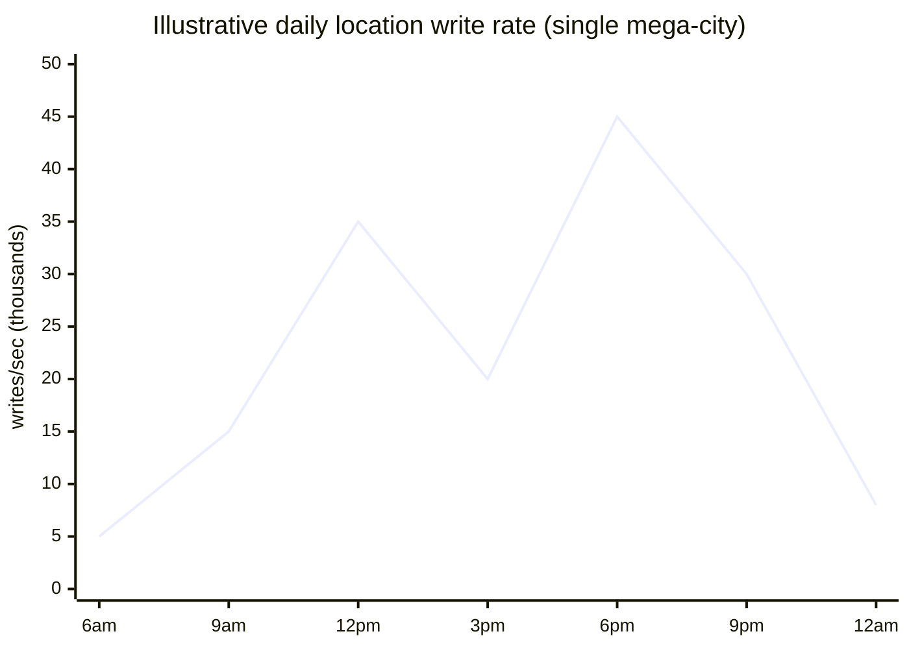

# Transaction Rates & Scale

[← Back to index](./README.md)

## What “transaction rate” means here

In location systems, throughput is usually measured in **events per second (EPS)**, not financial TPS:

| Event type | Who generates it | Typical frequency |
|------------|------------------|-------------------|
| GPS location write | Each active driver/courier | 0.2–0.5 Hz (every 2–5 s) |
| Dispatch / match query | Each ride request | Burst on demand |
| Tracking push | Each active order/trip viewer | 0.2–1 Hz per subscription |
| Distance / ETA query | Search, checkout, batching | Thousands–millions/min at peak |
| Analytics aggregation | Stream processors | Continuous windows (1 s – 5 min) |

## Reference numbers (published & estimated)

### Global ride-hailing (Uber-scale)

| Metric | Value | Notes |
|--------|-------|-------|
| Concurrent online drivers | ~5 M (global peak estimate) | Industry analyses |
| GPS updates received | ~83,000 / sec sustained | ~5M ÷ 4 s interval |
| Location write throughput (upper bound) | ~1.25 M writes / sec | Some analyses aggregate multi-region |
| Grab SEA concurrent drivers | ~1.5 M | [GPS ingestion at scale](https://tanhdev.com/series/ride-hailing-realtime-architecture/part-1-location-ingestion/) |
| Grab location msg rate | ~375,000 msg/s | 1.5M ÷ 4 s |
| End-to-end phone → Redis | &lt; 200 ms | gRPC + Kafka pipeline |
| Dispatch decision budget | &lt; 100 ms | Candidate search + routing |
| Ride offer push to driver | &lt; 100 ms | Uber RAMEN / gRPC streams |

### Per-city food delivery

| Metric | Value | Notes |
|--------|-------|-------|
| Active couriers (large city) | 5K – 50K | Peak lunch/dinner |
| Location updates | 1K – 25K / sec per city | 5K couriers ÷ 5 s |
| Concurrent tracking viewers | 50K – 500K | One WebSocket per open order screen |
| Peak dinner multiplier | 3–10× | Friday 7–9 PM |

### Swiggy-scale distance queries

- **Millions of orders/day** → distance used for discovery, batching, assignment, ETA ([Swiggy blog](https://blog.swiggy.com/women-in-tech/navigating-new-routes-meet-the-ladies-who-read-build-maps/))
- Pre-cached geohash distance cells avoid **real-time** third-party matrix calls at request time

## Back-of-envelope calculator

```
writes_per_sec = active_agents / avg_update_interval_seconds

Example — Bangalore dinner peak:
  30,000 couriers / 5 s = 6,000 location writes/sec (ingestion only)

Example — Uber global:
  5,000,000 drivers / 4 s = 1,250,000 writes/sec
```

Add **fan-out multiplier** for subscribers:

```
push_events_per_sec ≈ active_tracking_sessions / push_interval

If 200K customers watch orders and server pushes every 3s:
  200,000 / 3 ≈ 67,000 push messages/sec
```

## Latency budgets

```mermaid
gantt
    title Single GPS ping — hot path budget (~200 ms total)
    dateFormat X
    axisFormat %L ms

    section Mobile
    GPS read + batch           :0, 20
    Network + TLS              :20, 80

    section Edge
    Auth + validate            :80, 95
    Publish Kafka              :95, 110

    section Backend
    Consumer → Redis           :110, 125
    Fan-out → WebSocket        :125, 180

    section Client
    Render + interpolate       :180, 200
```



| Stage | Target | Failure if exceeded |
|-------|--------|---------------------|
| Ingestion edge | &lt; 15 ms | Backpressure, dropped pings |
| Kafka produce | &lt; 10 ms | Lag, stale dispatch |
| Redis write | &lt; 5 ms | Old positions in matching |
| Dispatch read (7 H3 cells) | &lt; 1 ms | Misses 100 ms SLA |
| WebSocket delivery | &lt; 50 ms | Janky map |
| **Total freshness** | **&lt; 200 ms** | User sees lag |

## Why REST polling fails at these rates

| Approach | 5M drivers × 0.25 Hz | Problem |
|----------|------------------------|---------|
| REST POST per ping | 1.25M HTTP req/s | TCP+TLS handshake overhead |
| gRPC / MQTT stream | 5M persistent conns | Multiplexed, Protobuf ~40–60 B |
| Customer polling 1 Hz | 5M × 1 = 5M req/s | Wastes bandwidth; 1 s lag |

Industry shift: **persistent connections** (gRPC streams, WebSockets, MQTT) with **binary serialization** (Protobuf).

## Kafka throughput design

| Parameter | Typical choice | Rationale |
|-----------|----------------|-----------|
| Partitions | Hundreds–thousands | Parallel consumers; avoid hot partition |
| Partition key | H3 cell or city | Locality for Redis updates |
| Retention | 24 h – 7 d | Replay on consumer failure |
| Compression | lz4 / zstd | GPS payloads small but volume huge |

Uber demand pipeline reference: **~120K events/s** into Flink for hex aggregation ([Uber streaming pipelines blog](https://www.uber.com/lt/en/blog/building-scalable-streaming-pipelines/)).

## Redis capacity

Single Redis node: **500K+ ops/sec** for simple commands.

| Fleet size | Update rate | GEOADD/sec | Sharding |
|------------|-------------|------------|----------|
| 100K drivers / 4 s | 25K/s | Comfortable single shard | Optional |
| 1M drivers / 4 s | 250K/s | Redis Cluster by city | Required |
| 5M drivers / 4 s | 1.25M/s | Multi-region clusters | Required |

Dispatch adds **reads**: each ride request = 1 pipelined MGET across 7–37 H3 keys. Peak cities may see **10K+ dispatch reads/sec** layered on writes.

## WebSocket / connection scale

| Component | Scale pattern |
|-----------|---------------|
| Connection count | 1–5M concurrent (drivers + viewers) |
| Server model | Stateless WS nodes + sticky sessions or pub/sub bridge |
| Cross-node fan-out | Redis Pub/Sub, Kafka compact topic, or dedicated message bus |
| Memory per connection | ~10–50 KB → 1M conns ≈ 10–50 GB fleet-wide |

Uber **RAMEN** holds **bidirectional gRPC streams** to driver apps for offers and updates ([RAMEN architecture](https://tanhdev.com/series/ride-hailing-realtime-architecture/part-6-realtime-push-ramen/)).

## Peak vs average



Systems are sized for **peak × headroom (2–3×)**, not average. Autoscaling handles:

- WS connection count (evening food peak)
- Kafka consumer lag
- Flink checkpoint duration

## Comparison: ride vs food peak patterns

| | Ride-hailing | Food delivery |
|---|-------------|---------------|
| Peak times | Morning/evening commute, events, airports | Lunch (12–2), dinner (7–10) |
| Duration of high load | 1–2 h spikes | 2–3 h spikes, sharper |
| Geo concentration | CBD, transit hubs | Restaurant clusters + residential |
| Update interval | Often faster (2–4 s) | Often slower (5–10 s) |

## Database TPS vs location EPS

Do not conflate them:

| Operation | Rate class |
|-----------|------------|
| GPS write to Redis | 250K–1M+ EPS |
| Trip created (SQL INSERT) | Hundreds–few K TPS |
| Payment capture | Much lower TPS |
| Distance cache read | Millions/min (KV) |

**Only hot state touches Redis/stream.** SQL sees order lifecycle events, not every GPS ping.

## Scaling levers (summary)

1. **Geo-partition** everything (Kafka, Redis, WS routing)
2. **Pre-index** with H3 — never scan full fleet
3. **Decouple** ingest from dispatch from analytics (Kafka)
4. **Precompute** distances (Swiggy geohash cache)
5. **Aggregate before store** for analytics (Flink → 20× fewer writes)
6. **Adaptive GPS rate** on mobile to cut volume 30–50% with no UX loss

## Further reading

- [04 — High-volume data management](./04-high-volume-data-management.md)
- [07 — Live updates](./07-live-updates-and-real-time-relay.md)
- [Uber Part 1 — 5M drivers tracking](https://ai.plainenglish.io/uber-architecture-part-1-why-tracking-5-million-drivers-every-second-is-one-of-techs-hardest-6ca606892497)
