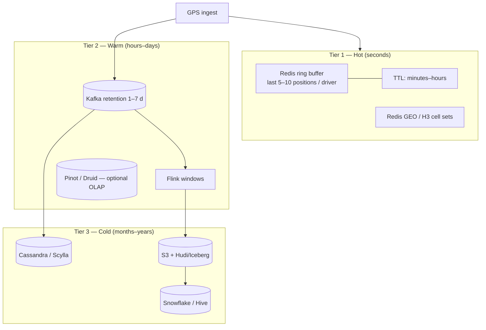
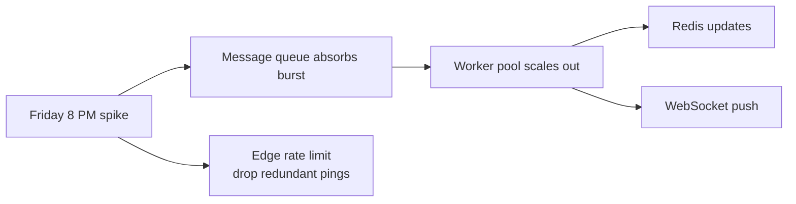

# Managing High-Volume Location Data

[← Back to index](./README.md)

## The core problem

A large platform generates **billions of GPS points per day**. Storing and querying them naively fails on three axes:

1. **Write amplification** — every ping cannot go to SQL with spatial indexes
2. **Storage cost** — raw lat/lng history is petabytes over years
3. **Query mismatch** — dispatch needs ms; analytics needs hours of history

Solution: **tiered data lifecycle** with different retention, format, and access patterns per tier.

## Three-tier architecture



| Tier | Retention | Granularity | Use cases |
|------|-----------|-------------|-----------|
| Hot | Minutes – 2 h | Every ping (or last N) | Dispatch, live map, ETAs |
| Warm | 1 – 30 d | Raw or 1-min aggregates | Ops dashboards, replay, ML features |
| Cold | 1 – 7+ y | Raw + hourly/daily rollups | Compliance, research, training data |

## Write path: fan-out from one stream

Uber’s pattern ([Part 4 — Ring buffer + Cassandra](https://medium.com/codetodeploy/)): **one Kafka event, multiple independent consumers**:

```
                    ┌→ Redis consumer (ring buffer, present)
GPS → Kafka topic ──┼→ Cassandra consumer (durable history)
                    └→ Flink consumer (aggregations, surge)
```

Consumers **do not block each other**. Dispatch never waits on analytics.

## Ring buffer — keep only what dispatch needs

Redis stores **last 10 positions per driver**, not full history:

- Fixed memory per driver (~1 KB)
- 5M drivers × 1 KB ≈ **5 GB** — fits RAM
- Sub-millisecond reads for map rendering and short-horizon ETA

Older points are dropped automatically (LIST trim or TTL).

## Geo-partitioning Kafka

Partition by **H3 cell** (not `driver_id`) so that:

- All drivers in a neighborhood land in the **same partition**
- Consumer process updates **local Redis shard** without cross-partition joins
- Dispatch reads are **cache-coherent**

**Hot partition risk:** stadium exit, concert — one H3 cell gets 100× normal rate.

Mitigations:
- Finer sub-partitioning within cell (hash driver_id suffix)
- Rate limit at ingestion edge
- Adaptive GPS thinning in dense cells

## Aggregation before storage (20× reduction)

Raw heatmap at 1M events/s is unsustainable. **Flink pre-aggregates** into H3 buckets:

```
Input:  1,000,000 events/sec (lat, lng, event_type)
Output: 50,000 cell-count records/sec (h3_cell, count, window)
```

([Geospatial heatmap design](https://www.takeuhigh.org/docs/system-design/core-concepts/solved-at-scale/chapter-08-analytics-monitoring/06-geospatial-heatmap/))

Uber demand/supply pipeline aggregates by **hex + time + product** before writing to Docstore ([Uber Flink blog](https://www.uber.com/lt/en/blog/building-scalable-streaming-pipelines/)).

## Data lake ingestion at petabyte scale

Uber **IngestionNext** moved lake ingestion from batch (hours lag) to **Flink → Apache Hudi** ([blog](https://www.uber.com/iq/en/blog/from-batch-to-streaming-accelerating-data-freshness-in-ubers-data-lake/)):

| Challenge | Streaming solution |
|-----------|-------------------|
| Small files | Hudi compaction + clustering |
| Partition skew | Salting, custom partitioners |
| Checkpoint sync | Flink exactly-once + Hudi transactions |
| Cost | Fewer batch jobs; fresher data with less duplicate processing |

## Swiggy distance pre-computation

Instead of storing all pairs, Swiggy stores **restaurant → geohash cell** distances within service radius:

1. Restaurant at geohash precision 7
2. Precompute distances to all cells in haversine circle (max delivery km)
3. Store in **Aerospike**
4. Non-urgent precision-8 lookups **queued via Kafka** to smooth GDMA/OSM load ([Distance Service](https://bytes.swiggy.com/swiggy-distance-service-9868dcf613f4))

This converts **O(billions)** pairs into **O(restaurants × cells_in_radius)** — tractable with nightly + incremental jobs.

## Retention & deletion policies

| Data class | Retention | Deletion trigger |
|------------|-----------|------------------|
| Live driver position | Until offline + 1 h | Redis TTL |
| Active order tracking | Order lifetime + 24 h | Key expire on delivery |
| Trip GPS trail | 90 d – 2 y | Policy / regulation |
| Aggregated hex stats | 2–5 y | Cheaper storage tier |
| Raw lake events | 7 y or legal hold | S3 lifecycle → Glacier |

GDPR / privacy: **anonymize** driver/rider IDs in cold tier; support **right-to-erasure** via keyed deletion in Cassandra partitions.

## Compression & encoding

| Technique | Savings |
|-----------|---------|
| Protobuf vs JSON | 3–10× payload size |
| Delta encoding (Δlat, Δlng vs prev) | 2–4× on streams |
| H3 cell ID instead of float lat/lng | Fixed 64-bit key; enables grouping |
| Columnar parquet in lake | 5–10× vs row JSON |

## Read replicas & CQRS

**Command Query Responsibility Segregation** for location:

| Path | Store | Pattern |
|------|-------|---------|
| Write | Kafka → Redis | Event sourcing lite |
| Read (dispatch) | Redis only | Never hit SQL |
| Read (support ticket) | Cassandra by trip_id | Time-range scan |
| Read (BI) | Warehouse | Batch / streaming SQL |

## Handling burst traffic (food peak)



1. **Queue depth** as buffer (SQS, Kafka lag acceptable for analytics, not dispatch)
2. **Drop policy**: if courier hasn’t moved &gt;30 m, skip publish
3. **Coalesce**: latest position wins per 1 s window per driver
4. **Autoscale** WS and consumer pods on lag / CPU

## Cost optimization checklist

- [ ] TTL on all hot keys — no immortal Redis entries
- [ ] Sample GPS for analytics (e.g. 1 in 10) where full fidelity unnecessary
- [ ] Compact H3 representations for historical hex sets ([Uber H3 compact](https://www.uber.com/us/en/blog/h3/))
- [ ] Self-host routing (OSM) vs per-request Maps API billing
- [ ] Tier S3: Standard → IA → Glacier for old trajectories

## Failure & recovery

| Failure | Impact | Recovery |
|---------|--------|----------|
| Redis cluster fail | Dispatch degraded | Failover replica; rebuild from Kafka replay |
| Kafka lag | Stale positions | Scale consumers; temporary surge in staleness |
| Consumer bug | Wrong cell assignment | Reset offset; replay from checkpoint |
| Lake compaction stuck | Analytics delay | Manual compaction trigger; does not affect live map |

## Further reading

- [02 — Databases & spatial indexing](./02-databases-and-spatial-indexing.md)
- [06 — Analytics](./06-analytics.md)
- [Uber — From batch to streaming data lake](https://www.uber.com/iq/en/blog/from-batch-to-streaming-accelerating-data-freshness-in-ubers-data-lake/)
