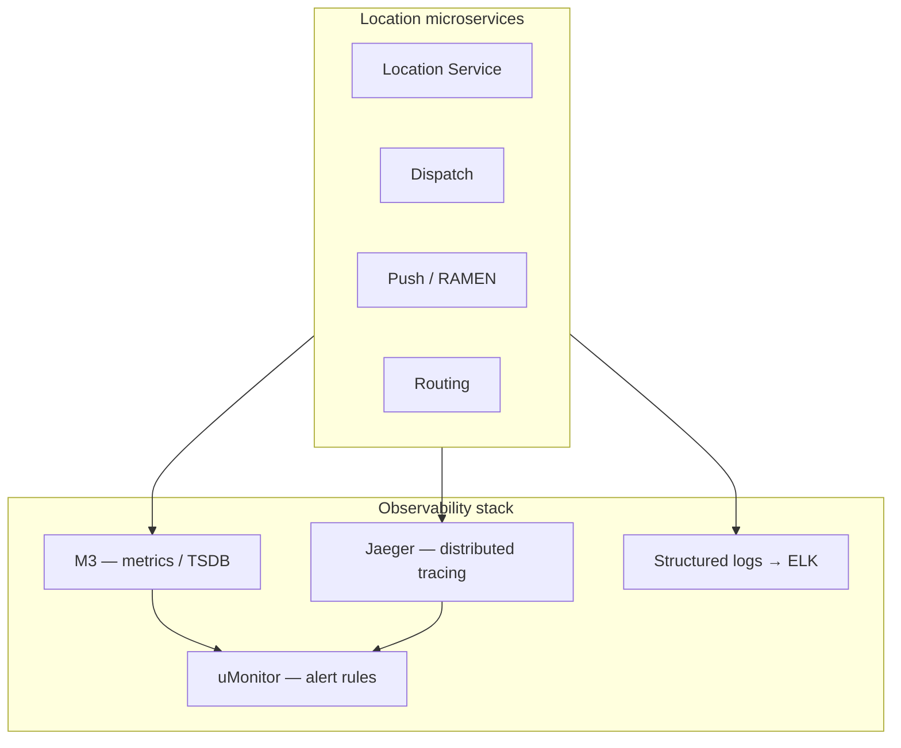

# Observability for Map & Location Systems

[← Back to index](./README.md)

## Why observability is harder here

Location stacks differ from typical CRUD APIs:

- **Firehose metrics** — 250K+ events/sec dwarf normal HTTP RPS dashboards
- **Tail latency matters** — p99 dispatch &gt;500 ms feels broken; average hides pain
- **Geo skew** — one stadium cell can spike while global metrics look healthy
- **Cross-service traces** — one GPS ping touches edge → Kafka → Redis → WS → mobile

You need **metrics, logs, traces, and synthetic probes** tuned for geospatial workloads.

## The three pillars (Uber-scale reference)

Uber’s observability platform ([Optimizing Observability blog](https://www.uber.com/us/en/blog/optimizing-observability/), [Pragmatic Engineer deep-dive](https://newsletter.pragmaticengineer.com/p/how-uber-built-its-observability-platform)):



| Tool | Role | Location-specific use |
|------|------|----------------------|
| **Jaeger** | Distributed tracing | Trace one ride request across dispatch + routing + push |
| **M3 / Prometheus** | Time-series metrics | Ingest lag, Redis latency, WS connection count |
| **uMonitor / Alertmanager** | Alert routing | Page on dispatch p99, not on average CPU |
| **Structured logs** | Debug & audit | `driver_id`, `h3_cell`, `trip_id`, `request_id` |

M3 processed **~600M data points/sec** at Uber in 2018 — built because Prometheus + Cassandra could not handle **high-cardinality** tags like city × product × status ([M3 blog](https://www.uber.com/do/en/blog/m3/)).

## Golden signals for location

Adapt Google SRE “four golden signals”:

| Signal | Key metrics | Alert when |
|--------|-------------|------------|
| **Latency** | ingest_p99, redis_mget_p99, dispatch_p99, ws_delivery_p99 | p99 &gt; SLA for 5 min |
| **Traffic** | gps_events/sec, ws_connections, dispatch_qps | &gt;3× baseline (capacity) |
| **Errors** | invalid_gps_rate, auth_fail, kafka_produce_errors | Error budget burn |
| **Saturation** | kafka_consumer_lag, redis_memory, ws_cpu | Lag &gt; N seconds |

### Location-specific metrics

```
# Ingestion
location.ingest.rate{region,city}
location.ingest.dropped{reason=duplicate|invalid|rate_limit}
location.ingest.latency_ms{percentile}

# Spatial index
redis.geoadd.latency_ms
redis.mget.cells{ring_size}
h3.encode.errors

# Dispatch
dispatch.candidates.count{h3_cell}
dispatch.ring_expansions{from_k,to_k}
dispatch.assignment.latency_ms
dispatch.no_drivers{region}

# Push / tracking
websocket.connections.active
websocket.push.latency_ms
websocket.reconnect.rate

# Freshness (critical!)
location.staleness_seconds{driver_id}  # now - last_update_ts
order.tracking.gap_seconds{order_id}
```

**Staleness** is the metric users feel: “car hasn’t moved in 30 s.”

## Distributed tracing example

Trace ID propagated from mobile → edge → Kafka (header) → consumers → push:

```
Span: POST /location/update          12 ms
  └─ Span: kafka.produce             3 ms
       └─ Span: location-consumer    8 ms
            └─ Span: redis.geoadd    1 ms
                 └─ Span: ws.publish 4 ms
```

Jaeger helps answer: “Dispatch slow in BLR only — is it Redis or routing?” ([Distributed tracing at Uber](https://www.uber.com/us/en/blog/distributed-tracing/))

## Logging best practices

### Structured fields (always)

```json
{
  "level": "info",
  "service": "location-ingest",
  "request_id": "6d7ca3-3a84-8c4-853358e605",
  "driver_id": "d_abc123",
  "h3_cell": "8928308280fffff",
  "city": "bangalore",
  "lat": 12.9716,
  "lng": 77.5946,
  "latency_ms": 14
}
```

Namma Yatri / Atlas uses **request_id** from load balancer and **txnId** for Beckn API correlation ([Atlas README](https://github.com/juspay/atlas)).

### What NOT to log

- Full GPS trail at INFO (volume + PII)
- Raw JWT tokens
- Every ping in production — **sample** 0.1% for debug

## Alerting strategy

Uber splits alerting ([Observability at scale](https://www.uber.com/us/en/blog/observability-at-scale/)):

| System | Monitors |
|--------|----------|
| **uMonitor** | Application metrics in M3 |
| **Neris** | Host-level (disk, NIC, kernel) |

### Alert tiers

| Tier | Example | Response |
|------|---------|----------|
| P1 | Dispatch p99 &gt;500 ms in top 5 cities | Immediate page |
| P2 | Kafka lag &gt; 60 s | Scale consumers |
| P3 | WS reconnect storm +20% | Investigate deploy |
| P4 | Analytics pipeline delay | Next business day |

**Context-rich alerts:** attach recent deploy owner, link Jaeger trace, show **h3_cell** heatmap of errors.

## Dashboards that matter

### 1. Live operations map (internal)

- Supply/demand ratio by H3 hex (Uber heatmap)
- Ingest rate per city
- Red cells = stale driver data or consumer lag

### 2. SLO dashboard

```
SLO: 99% of dispatches complete candidate search in <100ms (30d window)
Error budget remaining: 42%
```

### 3. Customer impact

- % orders with tracking gap &gt;10 s
- Average map animation jitter (client-reported)

Tools: Grafana + M3/Prometheus, or Datadog/New Relic at smaller scale.

## Synthetic monitoring

Probe bots simulate:

1. Fake driver sending GPS every 4 s in each region
2. Fake rider requesting dispatch
3. End-to-end latency measurement

Catches regional DNS, certificate, or Redis shard failures before users flood support.

## Mobile client observability

| Signal | How |
|--------|-----|
| WebSocket disconnect rate | Client analytics (Firebase, Amplitude) |
| GPS permission denied | App event |
| Time since last server update | Log when &gt;15 s |
| Map tile load failures | Map SDK callbacks |

Correlate with **backend staleness** to split network vs server bugs.

## GPS quality monitoring

Server-side checks ([ingestion edge patterns](https://tanhdev.com/series/ride-hailing-realtime-architecture/part-1-location-ingestion/)):

| Anomaly | Detection | Action |
|---------|-----------|--------|
| Speed &gt; 200 km/h | Haversine / dt | Drop ping |
| Accuracy &gt; 100 m | GPS metadata | Down-weight for dispatch |
| Duplicate timestamp | Idempotency key | Dedupe |
| Teleport | Distance &gt; threshold in 1 s | Flag driver; smooth for UI only |

Track **`gps.anomaly.rate`** by OS version and device model.

## Open-source stack (startup / mid-size)

| Component | Option |
|-----------|--------|
| Metrics | Prometheus + Grafana |
| Traces | Jaeger or Tempo |
| Logs | Loki or ELK |
| Alerts | Alertmanager → PagerDuty/Slack |
| On-call | Incident.io, Opsgenie |

Uber needed M3; most teams do not until **cardinality explosion** (city × vehicle × error_code × h3).

## Cardinality warning

Tagging every metric with `driver_id` or `h3_cell` at full resolution **will destroy** your TSDB.

Safe patterns:
- Aggregate at **city** or **region**
- Top-N hex cells only for debug dashboards
- Use **logs/traces** for per-driver investigation

## Runbooks (minimum set)

1. **Kafka consumer lag high** — scale consumers, check hot partition, verify producer rate
2. **Redis memory max** — check TTL policies, ring buffer size, eviction stats
3. **WS reconnect storm** — recent deploy? LB config? Certificate expiry?
4. **Dispatch no drivers** — data staleness vs true supply shortage
5. **Regional outage** — fail over read replica; disable city in app if needed

## Further reading

- [03 — Transaction rates](./03-transaction-rates-and-scale.md)
- [06 — Analytics](./06-analytics.md)
- [Jaeger — open source tracing](https://www.jaegertracing.io/)
- [Uber — Alerting ecosystem](https://www.uber.com/us/en/blog/observability-at-scale/)
