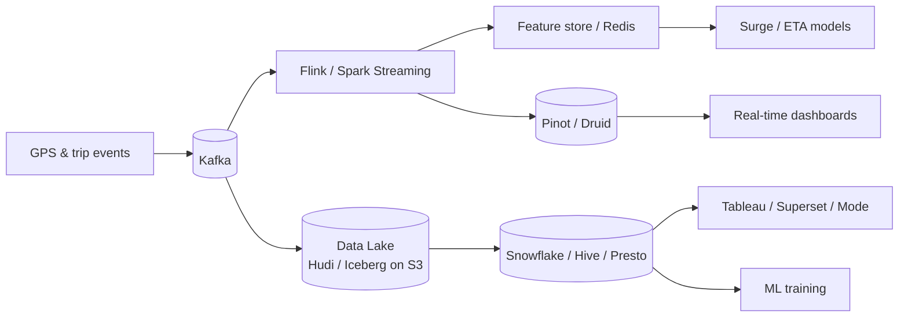

# Analytics Around Location & Map Data

[← Back to index](./README.md)

## Analytics vs operational hot path

| Concern | Hot path | Analytics path |
|---------|----------|------------------|
| Latency | &lt;200 ms | Seconds to hours OK |
| Data | Latest position | Historical + aggregated |
| Store | Redis | Lake + warehouse |
| Users | Dispatch, live map | PM, data science, ops |

**Never** run heavy SQL on the dispatch Redis cluster. Analytics consumes **Kafka-derived** datasets.

## End-to-end analytics pipeline



Reference stack from industry ([Kafka + Flink + Snowflake platform](https://medium.com/@stefentaime_10958/build-a-real-time-ride-sharing-data-platform-with-kafka-flink-snowflake-and-airflow-511753772bc1), [Uber IngestionNext](https://www.uber.com/iq/en/blog/from-batch-to-streaming-accelerating-data-freshness-in-ubers-data-lake/)).

## What companies analyze

### Marketplace (Uber, Ola, Namma Yatri)

| Analysis | Input data | Business use |
|----------|------------|----------------|
| Supply/demand heatmap | Driver pings + requests by H3 | Surge pricing, driver incentives |
| ETA accuracy | Predicted vs actual trip time | Model tuning, customer trust |
| Pickup friction | Time driver spends near pin | Product UX, geofence size |
| Deadheading | Empty miles between trips | Driver earnings, efficiency |
| Conversion funnel | Request → match → complete by zone | City launch decisions |

Uber aggregates demand/supply **per hexagon, per minute, per product** (UberX, etc.) via Flink — ~120K events/s input ([streaming pipelines blog](https://www.uber.com/lt/en/blog/building-scalable-streaming-pipelines/)).

### Food delivery (Swiggy, Zomato)

| Analysis | Input data | Business use |
|----------|------------|----------------|
| Batchability | Order pairs + OSM distance | FOODMATCH-style batching ([Swiggy paper](https://arxiv.org/pdf/2008.12905)) |
| Delivery time SLA | Courier trail + timestamps | Restaurant rankings |
| Serviceability | Restaurant ↔ customer distance cache | Discovery radius |
| Courier utilization | Active time vs idle | Payout and staffing |
| Address quality | Geocode success, correction rate | Maps team priorities |

Swiggy’s research paper reports **~30% delivery time reduction** from optimized batching using dynamic road network weights from OSM + historical speeds.

## H3 as the analytics grain

Using the **same H3 resolution** for ops and analytics avoids join hell:

```
Raw event (lat, lng) → h3_r7 = geoToH3(lat, lng, 7)
GROUP BY h3_r7, date_trunc('minute', ts), product_type
```

Benefits:
- Fixed cardinality (~millions of cells globally, thousands per city)
- Compatible with Uber open-source tooling (H3, Kepler.gl)
- Multi-resolution drill-down (city res 5 → neighborhood res 9)

## Stream processing patterns

### Tumbling window aggregation

```
Every 60 seconds:
  COUNT(requests), COUNT(drivers), AVG(wait_time)
  GROUP BY h3_cell, city_id
```

### Session windows (trips)

Group GPS points by `trip_id` until trip ends → compute distance, route adherence, speed profile.

### Geofencing in Flink

Join GPS stream with broadcast polygon set (airports, surge zones) → emit enter/exit events.

### MobilityDB / PostGIS batch path

For smaller deployments, Flink JDBC sink to **MobilityDB** stores `TGeogPoint` trajectories ([MobilityFlink-Deck example](https://github.com/MobilityDB/MobilityFlink-Deck)).

## Real-time vs batch analytics

| Type | Latency | Examples | Tech |
|------|---------|----------|------|
| **Real-time** | 1.30 s | Surge heatmap, live ops map | Flink → Redis/Pinot |
| **Near-line** | 5.30 min | Hourly ETA calibration | Spark streaming → lake |
| **Batch** | Daily | City expansion modeling | Airflow + Spark SQL |

Uber moved lake ingestion from **hours** to **minutes** with Flink + Hudi — same data serves BI and ML faster.

## Visualization — Kepler.gl

Uber open-sourced **[Kepler.gl](https://kepler.gl/)** (built on deck.gl) to explore massive geospatial datasets in the browser:

- Million-point scatter plots
- Hexbin layers aligned with H3
- Time playback of trajectories

Used by ops and data science — not embedded in consumer apps.

## Feature store for ML

Location-derived features feed models:

| Feature | Source | Consumer |
|---------|--------|----------|
| `demand_last_5min_h3` | Flink | Surge model |
| `avg_speed_h3_hour` | Historical lake | ETA model |
| `driver_accept_rate_zone` | Warehouse | Dispatch ranking |
| `restaurant_prep_time` | Order events | Delivery promise |

Uber writes features to **Docstore** (internal KV) after optional Kafka buffer for write smoothing ([Flink blog](https://www.uber.com/lt/en/blog/building-scalable-streaming-pipelines/)).

## ETA & routing analytics

**Switchback experiments** (Wolt + Mapbox): randomly enable new routing/traffic model for time windows, compare predicted vs actual delivery times ([Wolt case study](https://www.mapbox.com/showcase/wolt)).

Metrics:
- MAPE (mean absolute percentage error) on ETA
- % deliveries late &gt;5 min
- Bias by neighborhood (systematic under-estimate in dense areas)

## Privacy & compliance in analytics

| Requirement | Implementation |
|-------------|----------------|
| Minimize PII | Hash user IDs in lake; separate mapping table with access control |
| Precision reduction | Store H3 cell center, not raw GPS, for BI |
| Retention limits | Auto-delete raw trails after N days |
| Aggregates only | Public open metrics (Namma Yatri open data) |

## Example warehouse schema

```sql
-- Daily hex-level metrics (derived, no raw PII)
/index
CREATE TABLE hex_supply_demand_daily (
  dt              DATE,
  city_id         VARCHAR,
  h3_cell         VARCHAR,
  product         VARCHAR,
  request_count   BIGINT,
  driver_hours    DOUBLE,
  avg_wait_sec    DOUBLE,
  p90_wait_sec    DOUBLE,
  surge_hours_pct DOUBLE
);
```

## Analytics anti-patterns

| Anti-pattern | Why it hurts | Fix |
|--------------|--------------|-----|
| Query production Redis for BI | Spikes dispatch latency | Export via Kafka |
| Store every ping in Snowflake raw | Cost explosion | Aggregate in Flink first |
| Per-driver metrics in Prometheus | Cardinality death | Sample + logs |
| Different grid systems in ops vs BI | Broken joins | Standardize on H3 |

## Team ownership (typical)

| Team | Owns |
|------|------|
| Maps / Geo | Routing accuracy, OSM edits, geocoding |
| Marketplace | Dispatch, surge, matching experiments |
| Data platform | Kafka, lake, Flink jobs |
| Data science | ETA, demand forecast models |
| Product analytics | Funnels, A/B tests on map UX |

Swiggy’s maps org spans **location intelligence, POI, addresses, routes** across the full delivery mile ([team blog](https://blog.swiggy.com/women-in-tech/navigating-new-routes-meet-the-ladies-who-read-build-maps/)).

## Further reading

- [04 — High-volume data management](./04-high-volume-data-management.md)
- [05 — Observability](./05-observability.md)
- [Uber — Building scalable streaming pipelines](https://www.uber.com/lt/en/blog/building-scalable-streaming-pipelines/)
- [Swiggy — FOODMATCH paper (arXiv)](https://arxiv.org/pdf/2008.12905)
- [Kepler.gl](https://kepler.gl/)
