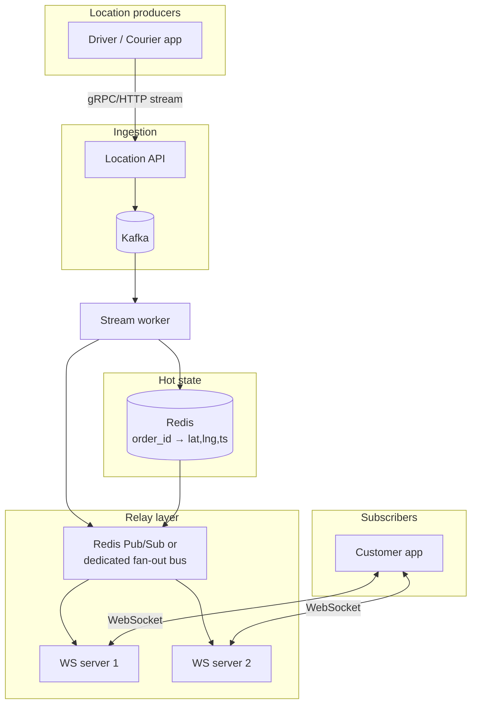
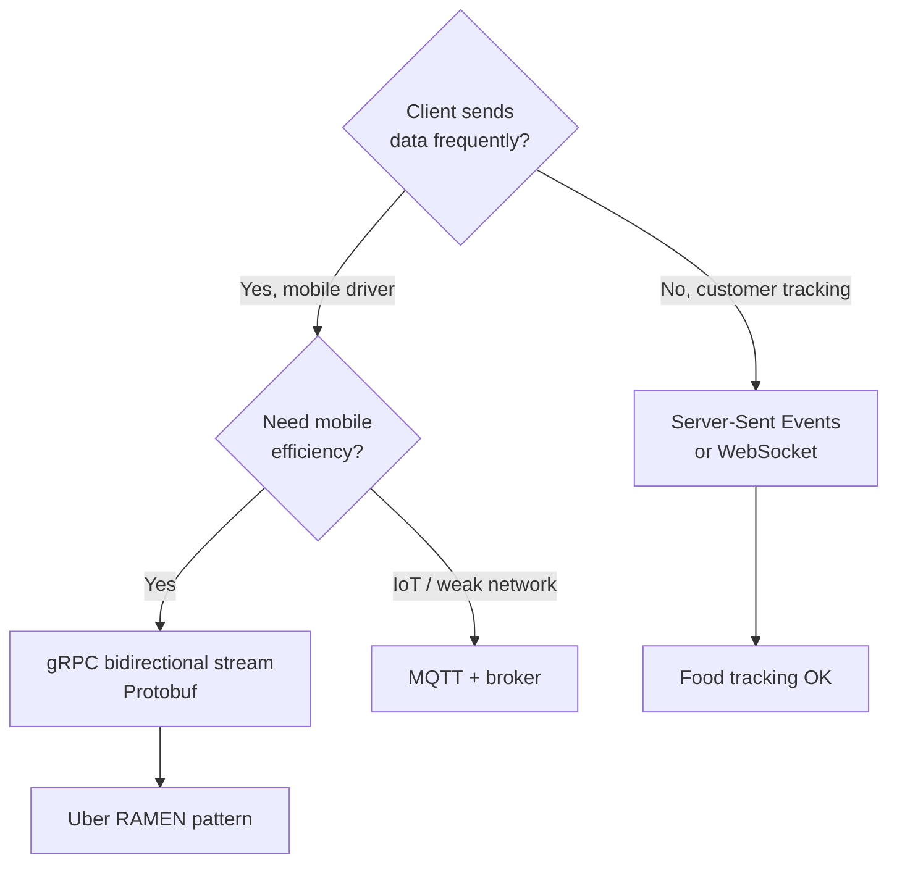

# Live Updates & Real-Time Relay

[← Back to index](./README.md)

## The user expectation

Customers expect the delivery bike or ride car to **move without refreshing** — smooth, continuous, sub-second feel. That requires **server-push**, not client-pull.

> “The backend pushes updates to the customer instead of the customer pulling them.”  
> — [Zomato-style tracking writeup](https://medium.com/@anuragkumbhare2043/how-zomato-shows-live-delivery-partner-movement-without-page-refresh-0a4148af3837)

## Push vs pull

| Model | Mechanism | Fit for live maps |
|-------|-----------|-------------------|
| **Polling** | Client GET every N seconds | Poor — lag ≥ N, wastes bandwidth |
| **Long polling** | Hold HTTP until event | OK for low frequency; overhead at scale |
| **SSE** | Server → client stream | Good for **tracking-only** (one direction) |
| **WebSockets** | Full duplex | Industry default for food tracking |
| **gRPC streaming** | HTTP/2 binary streams | Uber driver apps, internal services |
| **MQTT** | Pub/sub via broker | IoT; some early mobility stacks |

([Protocol comparison](https://charlessieg.com/articles/real-time-messaging-protocols-grpc-websocket-sse-deep-dive.html))

## Reference architecture



([Kafka + WebSocket + Redis trio](https://medium.com/@kanishks772/kafka-websockets-redis-the-trio-powering-every-food-delivery-app-532cdbd11318))

## Protocol selection guide



### Uber / Grab — gRPC streams

- **Persistent bidirectional stream** per driver ([RAMEN](https://tanhdev.com/series/ride-hailing-realtime-architecture/part-6-realtime-push-ramen/))
- Server pushes ride offers; driver pushes GPS on same connection
- Protobuf ~40–60 bytes per update vs JSON 200+ bytes
- Built-in flow control / backpressure

### Swiggy / Zomato — WebSockets + queue

Typical food flow ([gsavitha.in breakdown](https://gsavitha.in/blog/real-time-delivery/)):

```
Rider app → API → Queue (SQS/Kafka) → Worker → WebSocket event → Customer
```

Queue **decouples** ingest spikes from push capacity. Worker calls `deleteMessage` only after successful push (visibility timeout pattern).

### Namma Yatri — gRPC + Redis Streams

[notification-service](https://github.com/nammayatri/notification-service): **gRPC bidirectional streaming** with **Redis Streams** as broker — open-source reference for Indian mobility.

## Channel subscription model

Each active entity gets a logical channel:

| Platform | Channel key | Subscribers |
|----------|-------------|-------------|
| Food | `order:{order_id}:location` | Customer app (1–2 devices) |
| Ride | `trip:{trip_id}:driver` | Rider app |
| Driver dispatch | `driver:{driver_id}:offers` | Driver app |

On connect:
1. Authenticate (JWT tied to order/trip)
2. Subscribe to channel
3. Server sends **snapshot** (last known position from Redis)
4. Stream deltas on change

**Authorization critical** — channel IDs must not be guessable; validate order belongs to user.

## Scaling WebSocket servers

| Challenge | Solution |
|-----------|----------|
| 1M concurrent connections | Horizontal WS pods behind L4 LB |
| Sticky sessions | Same driver always hits same pod OR use shared pub/sub |
| Cross-pod fan-out | Redis Pub/Sub, NATS, or Kafka compact topic |
| Reconnect storm | Jittered backoff; rate limit reconnects per IP |
| Memory | ~10–50 KB/conn; cap idle connections |

Grab uses **WebSocket + Istio service mesh** for routing and mTLS ([architecture series](https://tanhdev.com/series/ride-hailing-realtime-architecture/part-6-realtime-push-ramen/)).

## Mobile → server: uplink patterns

| Technique | Benefit |
|-----------|---------|
| Adaptive interval (2–10 s) | Battery + bandwidth |
| Batch 2–3 points/message | 67% fewer network calls ([ingestion analysis](https://tanhdev.com/series/ride-hailing-realtime-architecture/part-1-location-ingestion/)) |
| Kalman filter on device | Cleaner uplink |
| Delta compression | Smaller payloads |
| Offline queue + replay | Tunnel / elevator gaps |

Protocols:
- **gRPC stream** preferred at Uber/Grab scale
- **HTTP/2 POST** acceptable for smaller fleets
- **MQTT LWT** (Last Will Testament) marks driver offline on abrupt disconnect

## Server → mobile: downlink patterns

| Event | Transport | Fallback |
|-------|-----------|----------|
| Location update | WebSocket / gRPC | — |
| Trip status change | Same stream | FCM/APNs data message |
| App backgrounded | — | Push notification + reduced GPS |
| Offer to driver | gRPC stream | High-priority push |

When app is **backgrounded**, OS limits GPS and sockets — use **FCM/APNs** to wake app for critical events.

## Frontend: smooth map animation

Server sends discrete points every 3–5 s. Client must **interpolate**:

```javascript
// Conceptual: lerp marker from prev to next over 1.5s
function onLocationUpdate(newLat, newLng) {
  animateMarker(prevLat, prevLng, newLat, newLng, durationMs: 1500);
  updateEta(newEta);
  optionallyRedrawRoutePolyline();
}
```

Map libraries (Google Maps SDK, Mapbox GL) support animated marker transitions. Without interpolation, icons **jump** — the #1 “tracking feels broken” complaint.

Also:
- Load basemap **once**; update overlay layer only
- Debounce route polyline recalculation (expensive)
- Show last-updated timestamp if gap &gt;15 s

## End-to-end latency budget

| Hop | Target |
|-----|--------|
| GPS → server ingest | 50–100 ms |
| Server → Redis | 10–30 ms |
| Redis → WS push | 20–50 ms |
| Client render | 16 ms (1 frame) |
| **Total** | **&lt;200 ms** typical |

Customer **perceived** smoothness also depends on 1–2 s animation window.

## Ordering & idempotency

GPS may arrive out of order on poor networks:

- Attach **monotonic sequence** or `timestamp_ms` per driver
- Server drops stale: `if ts <= last_ts: ignore`
- Kafka partition by `driver_id` or `h3` preserves order per key

## Complete Uber pipeline (reference)

From [ride-hailing architecture series](https://tanhdev.com/series/ride-hailing-realtime-architecture/part-6-realtime-push-ramen/):

```
① Driver GPS → Kalman → batch → gRPC → Location Service
② Location → H3 → Kafka "driver.location.updates"
③ Kafka → Redis GEO + Flink (surge) + Analytics
④ Rider request → DISCO matching → Redis nearby drivers
⑤ Match → RAMEN → gRPC → Driver phone (offer)
⑥ Accept → RAMEN → Rider app + location stream to rider map
Total: < 2 seconds request to car-on-map
```

## Failure modes & UX

| Scenario | User sees | Mitigation |
|----------|-----------|------------|
| WS disconnect | Frozen icon | Auto-reconnect; show “Reconnecting…” |
| Server coalesce | Slower updates | Acceptable if interpolated |
| GPS lost in tunnel | Straight-line drift | Map matching pause; resume on fix |
| Wrong channel auth | No updates | 403 + support alert |

## Further reading

- [01 — How it works](./01-how-it-works.md)
- [03 — Transaction rates](./03-transaction-rates-and-scale.md)
- [DEV — Zomato/Swiggy/Uber/Ola real-time location](https://dev.to/rachit_avasthi/how-platforms-like-zomato-swiggy-uber-and-ola-update-riders-location-in-real-time-3ic5)
- [Real-time delivery tracking engineering](https://medium.com/@officialchiragp1605/how-real-time-delivery-tracking-works-the-engineering-behind-the-magic-879b0b595f4e)
