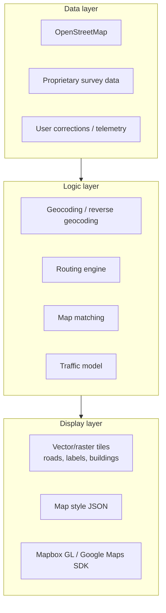
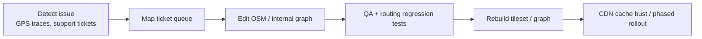

# Map Creation, Routing & Maintenance

[← Back to index](./README.md)

## Layers of “the map”

Consumer apps stack several independent layers:



Users see one map; engineering maintains **four products**: basemap tiles, search/geocoding, routing graph, and traffic.

## Basemap sources

| Provider | Data origin | Typical customers |
|----------|-------------|-------------------|
| **Google Maps** | Google survey + partners | Many apps default SDK |
| **Mapbox** | OSM + Mapbox telemetry + partners | DoorDash, Instacart, Wolt, Picnic |
| **Apple MapKit** | Apple | iOS-native apps |
| **OpenStreetMap direct** | Community + local mappers | Swiggy routing graph, self-hosted tiles |

Apps rarely draw maps from scratch. They license SDKs/APIs and optionally **customize styles** (dark mode, highlight building entrances).

## How vector tiles are built

Modern apps use **vector tiles** (MVT) — compact, styleable, zoom-friendly.

Pipeline:

```
Raw geodata (OSM PBF, government shapefiles, proprietary)
    → Processing (tippecanoe, Mapbox Tiling Service)
    → Vector tileset (S3/CDN)
    → Client SDK renders with GPU
```

**Mapbox Tiling Service (MTS)** ([blog](https://www.mapbox.com/blog/continuously-update-vector-tiles-as-data-changes-mapbox-tiling-service)):
- JSON **recipes** define zoom ranges, simplification, attributes
- Distributed parallel processing vs single-server PostGIS → MBTiles
- **Continuous publish** when source data changes (new roads, closures)

Legacy flow (still common):
```
PostGIS → tippecanoe → MBTiles → upload to Mapbox Studio
```

## Routing engines

Turn GPS coordinates into **driveable paths** and **ETAs**.

| Engine | License | Notes |
|--------|---------|-------|
| **OSRM** | Open source | Fast; widely self-hosted |
| **GraphHopper** | Open source | Swiggy’s choice for 2-wheeler profiles |
| **Valhalla** | Open source | Mapbox ecosystem |
| **Google Directions** | Commercial | Per-request billing |
| **Mapbox Directions** | Commercial | Traffic-aware profiles |

### Mapbox routing network

Mapbox maintains a **routing network** — roads (`ways`) with attributes: speed limits, turn restrictions, mode (car/bike/walk), accessibility ([Directions docs](https://docs.mapbox.com/help/dive-deeper/directions/)).

Profiles:
- `mapbox/driving`
- `mapbox/driving-traffic` — real-time + typical traffic
- `mapbox/cycling`, `mapbox/walking`

APIs used by logistics apps:
- **Directions** — turn-by-turn polyline
- **Matrix** — many-to-many time/distance (assignment, ETA)
- **Map Matching** — snap GPS trace to roads
- **Optimization** — multi-stop route order
- **Isochrone** — “how far in 15 min?”

([On-demand logistics — Mapbox](https://www.mapbox.com/on-demand-logistics))

## Swiggy: self-hosted OSM + GraphHopper

Why build custom ([OSM Distance Service](https://bytes.swiggy.com/the-osm-distance-service-part-1-evaluation-metrics-and-routing-configurations-6e8686ca814f)):

| Constraint | Third-party API | OSM + GraphHopper |
|------------|-----------------|-------------------|
| Cost at billions of queries | Prohibitive | Infra cost only |
| Two-wheeler distances | Often car-only tiers | Custom motorcycle profile |
| Latency at peak | Rate limits | Colocated in VPC |
| India lane connectivity | Generic | Team fixes OSM gaps |

Process:
1. Import OSM planet/regional extract into routing graph
2. Configure profiles: `motorcycle` vs `car` (highway tag restrictions)
3. Weight edges: `shortest`, `fastest`, `short-fastest`
4. Evaluate against ground-truth delivery times
5. **Patch missing roads** in OSM where fleet GPS shows systematic errors

Swiggy also uses **standard map providers** in customer-facing apps while **distance/ETA core** runs on OSM ([maps team blog](https://blog.swiggy.com/women-in-tech/navigating-new-routes-meet-the-ladies-who-read-build-maps/)).

## Traffic & dynamic edge weights

Static OSM speeds are wrong at rush hour. Platforms combine:

| Signal | Update frequency | Use |
|--------|------------------|-----|
| **Real-time traffic** | ~5 min tiles | Live ETA (Mapbox, Google) |
| **Historical typical** | Weekly models | Scheduled delivery promises |
| **Fleet telemetry** | Continuous | Swiggy: avg speed per edge × hour-of-day ([FOODMATCH paper](https://arxiv.org/pdf/2008.12905)) |
| **ML forecast** | Uber traffic transformer | Predictive congestion |

Wolt + Mapbox: **switchback experiments** validated Matrix API + live traffic improved ETA accuracy across markets ([Wolt showcase](https://www.mapbox.com/showcase/wolt)).

## Geocoding & Indian address problem

| Challenge | Engineering response |
|-----------|---------------------|
| Non-standard addresses (“near temple”) | Manual pin drop + saved places |
| Multiple units in one tower | Unit-level geocoding (Mapbox) |
| Rooftop vs road-center | Routable points / entrance hints |
| Local language | Multilingual search APIs |

Swiggy invests in **address recording at backend**, POI enrichment, and **nudging** customers to confirm pin location.

## Map matching (maintenance of *position*, not map)

Even perfect maps need **map matching** — aligning GPS to graph:

```
Noisy GPS points → Hidden Markov / Viterbi on road graph → Snapped trajectory
```

Used for:
- Display (car on road, not in building)
- ETA (remaining path distance)
- Analytics (true route adherence)

## Ongoing map maintenance workflow



### Detection sources

- Drivers systematically slow on one segment → missing road or wrong speed
- Geocode failures spike in new township
- Customer “wrong location” reports
- Construction — municipal open data, user reports

### Update cadence

| Asset | Typical refresh |
|-------|-----------------|
| Traffic tiles | 5 min (real-time) |
| OSM regional extract | Weekly – monthly |
| Routing graph rebuild | After OSM import |
| Vector basemap | Weekly or on-demand (MTS) |
| Geocoding index | Daily incremental |

## Custom map content for operations

Delivery apps add **private layers** not in public OSM:

- Restaurant kitchen entrance pins
- Gated community access points
- Parking spots for couriers
- Dark store / hub locations

Stored in internal DB (PostGIS) and overlaid on public basemap in driver app.

Picnic (grocery) uses Mapbox to **highlight house numbers and entrances** in custom driver app styling ([Picnic showcase](https://www.mapbox.com/showcase/picnic)).

## Build vs buy decision matrix

| Scale | Basemap | Routing | Recommendation |
|-------|---------|---------|----------------|
| Startup MVP | Google/Mapbox SDK | Provider API | Buy — speed to market |
| Single-city scale | Mapbox | Matrix API | Buy with traffic experiments |
| National food / mobility | Hybrid | Self-host GraphHopper/OSRM + OSM | Build core distance; SDK for display |
| Global ride-hailing | Custom + licensed | Proprietary + H3 dispatch | Build + partner data |

## Rendering pipeline (client)

1. SDK downloads vector tiles for viewport + zoom
2. GPU renders layers (roads, labels)
3. App draws **dynamic overlays** (markers, polylines) from server state
4. Style JSON controls colors, fonts, 3D buildings

Uber map rendering applies **smoothing** on server/client so discrete GPS becomes fluid animation ([Part 5 — Map Rendering](https://medium.com/codetodeploy/uber-architecture-part-5-the-dispatch-engine-and-map-rendering-64ac669fa698)).

## Legal & attribution

- OSM requires **© OpenStreetMap contributors** attribution
- Mapbox/Google have license restrictions on **storing** tiles and **redistributing** data
- Telemetry fed back to providers may be contractually required

Review license before caching tiles or exporting derived graphs.

## Open mobility maps (India)

**Namma Yatri** (open source, zero commission) relies on same industry map/routing providers at app level while open-sourcing **ride protocol (Beckn)** and **location/notification services** — not necessarily the basemap itself ([GitHub org](https://github.com/nammayatri)).

Beckn mobility schema includes **route geometry, waypoints, ETA, tracking** as standardized fields across BAP/BPP ([Beckn mobility overview](https://medium.com/@nandakishorep/beckn-in-mobility-revolutionizing-transportation-networks-249d4b7d2fb5)).

## Tooling cheat sheet

| Task | Tools |
|------|-------|
| Edit OSM | iD, JOSM editors |
| Host tiles | Mapbox, MapTiler, self-host Martin/tileserver-gl |
| Build graph | GraphHopper, OSRM, Valhalla |
| Process OSM | osmium-tool, planet extracts (Geofabrik) |
| Visual QA | Kepler.gl, QGIS |
| CI for maps | Routing regression tests on golden routes |

## Further reading

- [01 — How it works](./01-how-it-works.md)
- [02 — Databases & spatial indexing](./02-databases-and-spatial-indexing.md)
- [Swiggy Bytes — OSM Distance Service Part 1](https://bytes.swiggy.com/the-osm-distance-service-part-1-evaluation-metrics-and-routing-configurations-6e8686ca814f)
- [Mapbox — Mapbox Tiling Service](https://www.mapbox.com/blog/continuously-update-vector-tiles-as-data-changes-mapbox-tiling-service)
- [OpenStreetMap](https://www.openstreetmap.org/)
