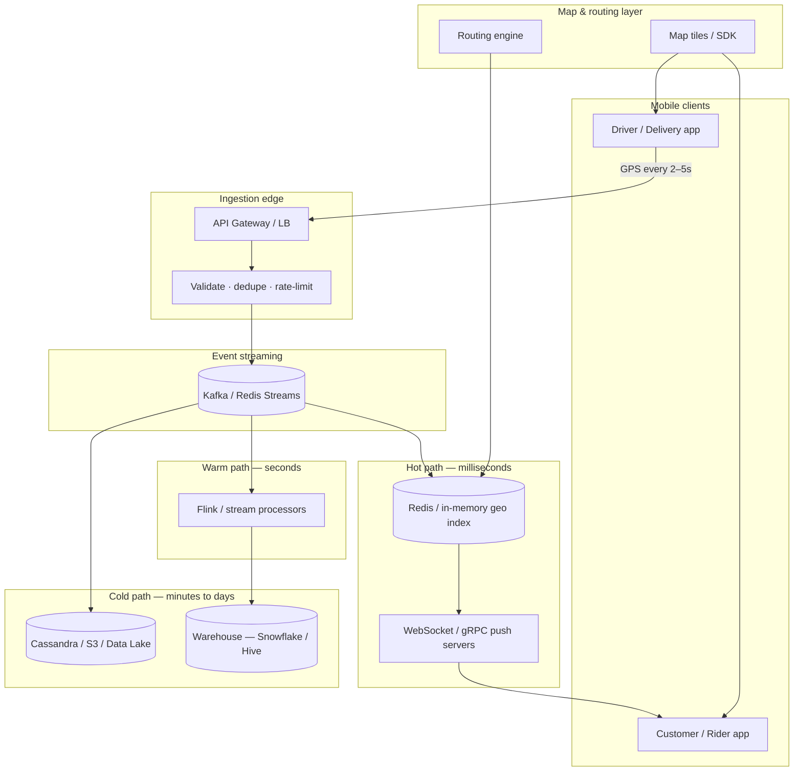

# Maps in Transport & Food-Delivery Platforms

Documentation on how ride-hailing (Uber, Ola, Namma Yatri, Rapido) and food-delivery (Swiggy, Zomato) apps use maps, location, and real-time systems at scale.

## Who this is for

Engineers, architects, and product folks who want a practical mental model of **how live maps work in production** — not just a system-design interview sketch.

## Topics

| # | Topic | File |
|---|--------|------|
| 1 | End-to-end flow: driver ↔ rider, agent ↔ restaurant ↔ customer | [01-how-it-works.md](./01-how-it-works.md) |
| 2 | SQL, NoSQL, spatial indexes (PostGIS, Redis GEO, H3) | [02-databases-and-spatial-indexing.md](./02-databases-and-spatial-indexing.md) |
| 3 | Transaction rates, throughput, and latency budgets | [03-transaction-rates-and-scale.md](./03-transaction-rates-and-scale.md) |
| 4 | Managing high-volume location data | [04-high-volume-data-management.md](./04-high-volume-data-management.md) |
| 5 | Observability: metrics, tracing, alerting | [05-observability.md](./05-observability.md) |
| 6 | Analytics pipelines and geospatial insights | [06-analytics.md](./06-analytics.md) |
| 7 | Live updates: WebSockets, gRPC, MQTT, push | [07-live-updates-and-real-time-relay.md](./07-live-updates-and-real-time-relay.md) |
| 8 | How maps are created, routed, and maintained | [08-map-creation-and-maintenance.md](./08-map-creation-and-maintenance.md) |

## High-level architecture

## Two product patterns, one engineering stack

| Pattern | Examples | Primary goal |
|---------|----------|--------------|
| **Marketplace matching** | Uber, Ola, Rapido, Namma Yatri | Find nearest available driver; assign ride in &lt;100 ms |
| **Order tracking** | Swiggy, Zomato, Uber Eats | Stream one courier’s position to one customer for ~30 min |

Both share GPS ingestion, spatial indexing, routing/ETA, and push-based updates. Matching adds **geo-partitioned search at fleet scale**; tracking adds **per-order channels and smooth UI animation**.

## Key numbers (order of magnitude)

These vary by city, time of day, and product — treat them as **engineering benchmarks**, not audited metrics.

| Metric | Typical range | Source context |
|--------|---------------|----------------|
| GPS update interval | 2–5 s (ride); 5–10 s (food) | Industry practice |
| Active drivers / couriers (large platform) | 1–5 M concurrent | Uber-scale estimates |
| Location writes | ~250K–1.25M / sec global | Uber / Grab engineering analyses |
| Dispatch budget | &lt;100 ms | Uber dispatch engine |
| End-to-end location freshness | &lt;200 ms (hot path) | gRPC + Kafka + Redis pipelines |
| Customer map animation | 1–2 s interpolation | Zomato-style tracking writeups |

## Primary references

### Official engineering blogs

- [Uber — H3 spatial index](https://www.uber.com/us/en/blog/h3/)
- [Uber — Observability (Jaeger, M3)](https://www.uber.com/us/en/blog/optimizing-observability/)
- [Uber — Streaming pipelines for real-time features](https://www.uber.com/lt/en/blog/building-scalable-streaming-pipelines/)
- [Uber — Batch to streaming data lake (Flink + Hudi)](https://www.uber.com/iq/en/blog/from-batch-to-streaming-accelerating-data-freshness-in-ubers-data-lake/)
- [Swiggy Bytes — Distance Service](https://bytes.swiggy.com/swiggy-distance-service-9868dcf613f4)
- [Swiggy Bytes — OSM Distance Service](https://bytes.swiggy.com/the-osm-distance-service-part-1-evaluation-metrics-and-routing-configurations-6e8686ca814f)
- [Mapbox — Directions & routing network](https://docs.mapbox.com/help/dive-deeper/directions/)
- [Namma Yatri — location-tracking-service (open source)](https://github.com/nammayatri/location-tracking-service)

### Community & long-form

- [DEV — Real-time rider location (Zomato, Swiggy, Uber, Ola)](https://dev.to/rachit_avasthi/how-platforms-like-zomato-swiggy-uber-and-ola-update-riders-location-in-real-time-3ic5)
- [Pragmatic Engineer — How Uber built its observability platform](https://newsletter.pragmaticengineer.com/p/how-uber-built-its-observability-platform)
- [Ride-hailing realtime architecture series (tanhdev.com)](https://tanhdev.com/series/ride-hailing-realtime-architecture/part-1-location-ingestion/)

## India-specific note

Indian apps face extra map challenges: non-standard addresses, narrow lanes, two-wheeler-first routing, and cost pressure on third-party map APIs. Swiggy and Namma Yatri both invest in **custom OSM/GraphHopper routing** and **open, Beckn-based mobility stacks** respectively — covered in topics 2 and 8.
